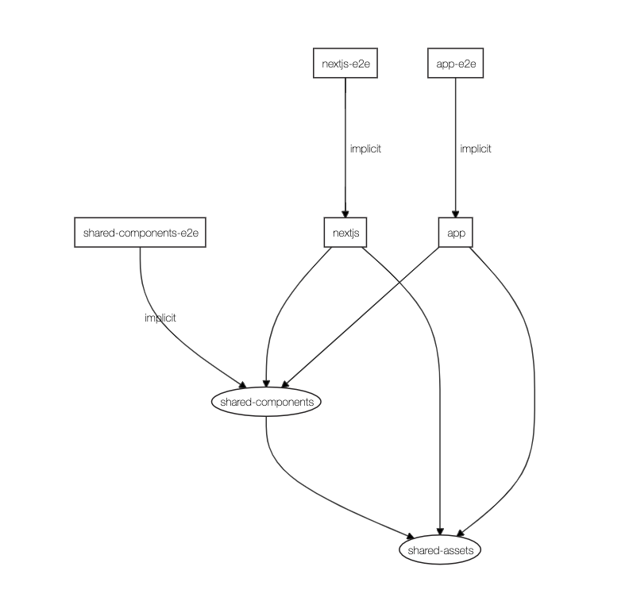

# NxNextjs

## Goal

- check how the Next.js works with Nx

- define shared components and use on the applications

- define shared assets (also webfonts) to use on the applications

- load the webfont added to the nx workspace and define to use it on the root `tailwind.config.js`

## Documentation

- [Nx](docs/nx.md)

  - [Nx Next.js Plugin](docs/nx-next-plugin.md)

  - [Nx Storybook Plugin](docs/nx-storybook-plugin.md)

- [TailwindCSS](docs/tailwindcss.md)

- [Project creation commands (steps)](docs/project-creation-commands.md)

## Project dependency graph

> **implicit** - means some sort of manual configuration

<!--

## Findings

define

-->

## Links

- [React](https://reactjs.org/)

  - [React Router](https://reactrouter.com/)

- [Next.js](https://nextjs.org/)

  - [Next.js Docs](https://nextjs.org/docs/getting-started)

  - [[YouTube] Next.js Crash Course - SSG, SSR, and more (Updated for Next.JS 10+) (2020)](https://www.youtube.com/watch?v=dArDe9v5QIA) - 2020/11/03

  - [[YouTube] Next.js Crash Course - SSG, SSR, API Routes, and more](https://www.youtube.com/watch?v=q-sYloF3xKM) - 2020/08/27

  - [[pt-BR][YouTube] Como inicio meus apps com ReactJS? Next.js, TypeScript, ESLint e Styled Components | Code/Drops #50](https://www.youtube.com/watch?v=1nVUfZg2dSA)

  - [[YouTube] Mastering the basics of SEO in React and Next.js](https://www.youtube.com/watch?v=GfsqFaiaK3A)

  - [What is Static Site Generation? How Next.js Uses SSG for Dynamic Web Apps | freeCodeCamp](https://www.freecodecamp.org/news/static-site-generation-with-nextjs/)

  - [Nested dynamic layouts in Next.js apps | React Tricks](https://reacttricks.com/nested-dynamic-layouts-in-next-apps/) - [youtube](https://www.youtube.com/watch?v=69-mnojSa0M) | [github](https://github.com/kheruc/rt-nested-layouts)

  - [[GitHub] erkobridee/nextjs-ssg-hello](https://github.com/erkobridee/nextjs-ssg-hello) - first contact with nextjs and the static site generation support

- [Nx: Extensible Dev Tools for Monorepos (React)](https://nx.dev/react)

  - [Plugins | Nx Docs](https://nx.dev/react/plugins/overview)

  - [[YouTube] Nx: Extensible Dev Tools for Monorepos (React)](https://www.youtube.com/watch?v=E188J7E_MDU)

  - [[YouTube] Nx Tutorial: High Quality React apps with Nx, Storybook & Cypress](https://www.youtube.com/watch?v=mfJBLhjYMdo)

  - [Scale React Development with Nx | Egghead.io](https://egghead.io/playlists/scale-react-development-with-nx-4038)

  - [Nx Now Supports Next.js | Nrwl](https://blog.nrwl.io/nx-now-supports-next-js-84ae3d0b2aed) - 2019/09/11

    - [[YouTube] Nx Adds Next.js Support](https://www.youtube.com/watch?v=dmwgmHJ8_Ms) - 2019/09/11

    - [[YouTube] Nx + Next.js = ❤️ - Adam L Barrett](https://www.youtube.com/watch?v=chBOFzpGpyo) - 2020/11/05

    - [Next.js guide | Nx Docs](https://nx.dev/latest/react/guides/nextjs)

    - [Next.js plugin | Nx Docs](https://nx.dev/latest/react/plugins/next/overview)

    - [@nrwl/next | npm](https://www.npmjs.com/package/@nrwl/next)

    - [[GitHub] nrwl/nx/packages/next](https://github.com/nrwl/nx/tree/master/packages/next) - Nx plugin for Next.js

    - [Painlessly Build and Deploy Next.js Apps With Nx | Nrwl](https://blog.nrwl.io/painlessly-build-and-deploy-next-js-apps-with-nx-225e2721da78) - 2020/05/14

    - [Improved Next.js support, auto-populated publishable library dependencies, and more in Nx 9.3! | Nrwl](https://blog.nrwl.io/improved-next-js-support-auto-populated-publishable-library-dependencies-and-more-in-nx-9-3-c7dc967dc065) - 2020/05/14

  - [Storybook](https://storybook.js.org/)

    - [[YouTube] Nx Tutorial: Nx Storybook Integration](https://www.youtube.com/watch?v=sFpqyjT7u4s)

    - [How to Use Storybook in an Nx Repo | Nx Docs](https://nx.dev/react/plugins/storybook/overview)

    - [Storybook support, run-many command, UI improvements, and more in Nx 8.8 | Nrwl](https://blog.nrwl.io/storybook-support-run-many-command-ui-improvements-and-more-in-nx-8-8-90575cb5dda4)

    - [Nx 8.8: Now You Can Write UI Tests with Storybook and Cypress | Nrwl](https://blog.nrwl.io/ui-testing-with-storybook-and-nx-4b86975224c)

    - [Creating a Storybook instance including stories from multiple libraries in a Nrwl Nx workspace](https://medium.com/front-end-weekly/creating-a-storybook-instance-including-stories-from-multiple-libraries-in-a-nrwl-nx-workspace-89009a2bddf7)

      - [[GitHub] juristr/nx-shared-storybook](https://github.com/juristr/nx-shared-storybook)

  - [Powering Up React Development With Nx | Nrwl](https://blog.nrwl.io/powering-up-react-development-with-nx-cf0a9385dbec)

  - [React Microfrontends and Monorepos: A Perfect Match | Nrwl](https://blog.nrwl.io/monorepos-and-react-microfrontends-a-perfect-match-d49dca64489a) - [demo](https://nrwl-nx-examples-cart.netlify.com/cart) | [code](https://github.com/nrwl/nx-examples)

## Development tip

- to make my life easier I have the current `node_modules` from the project mapped to the PATH env variable, that enables me to run the command `nx` directly, if you don't have if you must use the short cut mapped on the `package.json`, using it like `npm run nx ...` or it's also possible to use like `npx nx ...` (the `npx` will look into the local installed packages `./node_modules/` and on the global installed packages)

  - `./node_modules/.bin`

### Known issues on MacOS

- [How to fix the Node gyp Error: No Xcode or CLT version detected | Reactgo](https://reactgo.com/gyp-xcode-or-clt-version-detected/)
